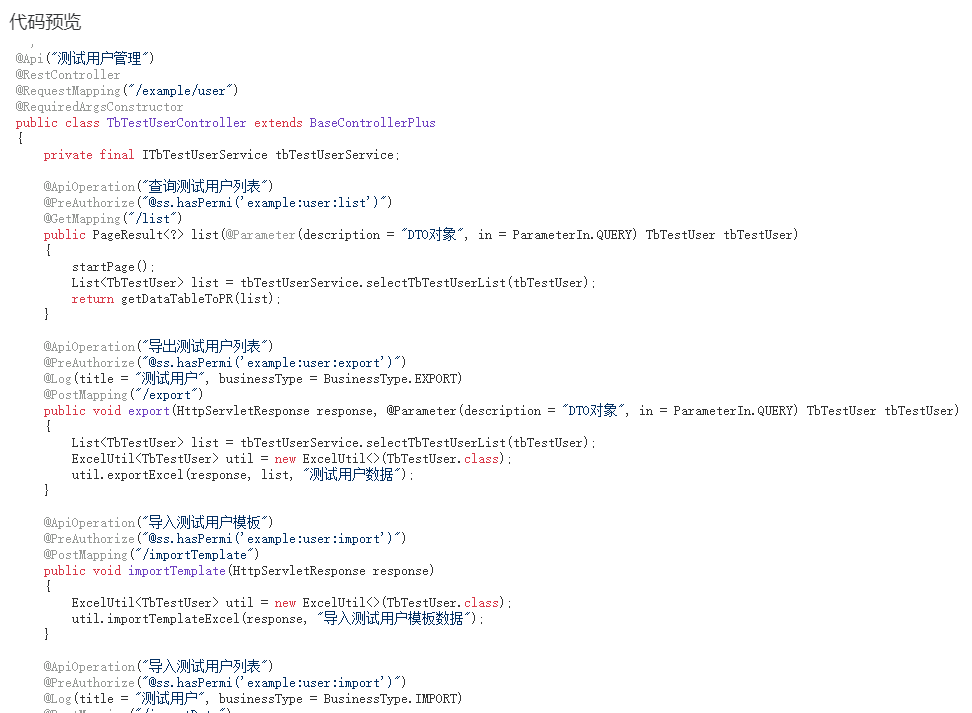
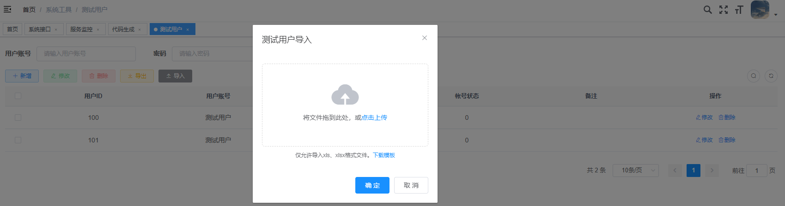
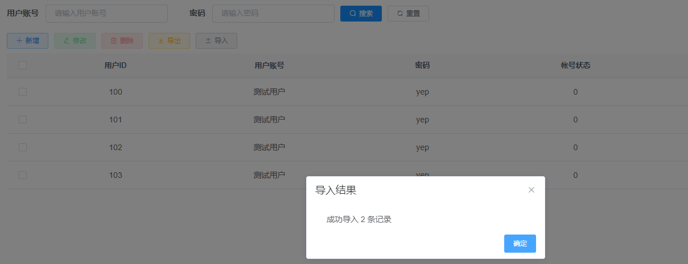
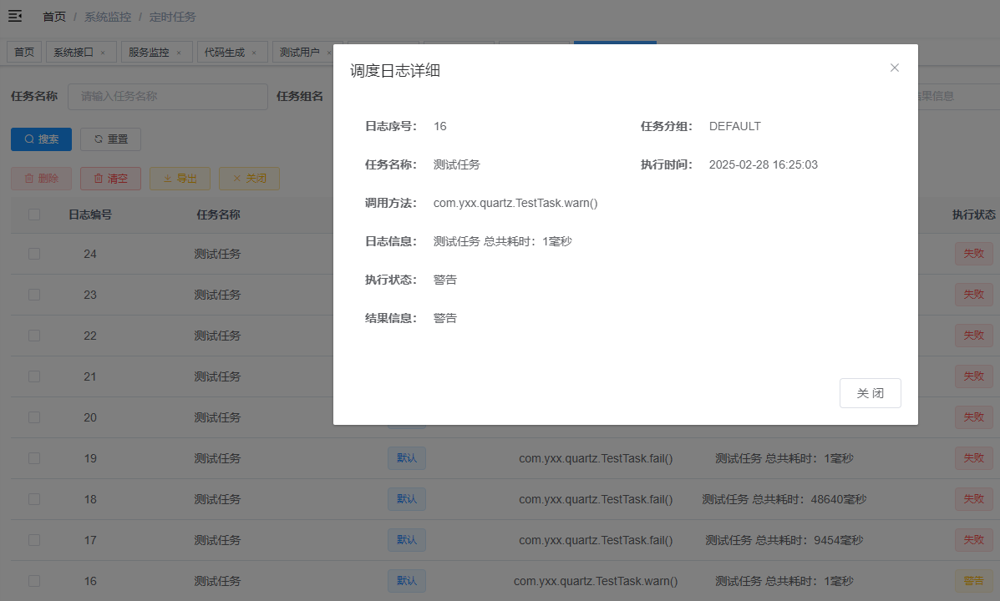
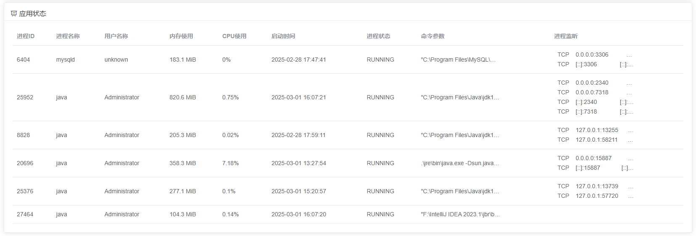
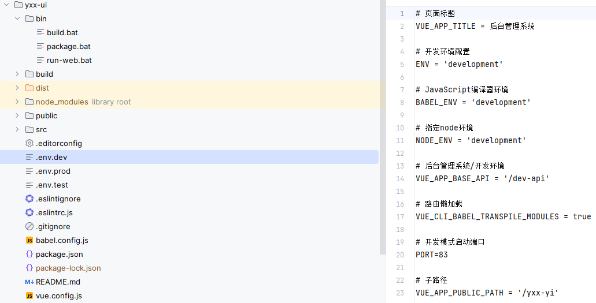
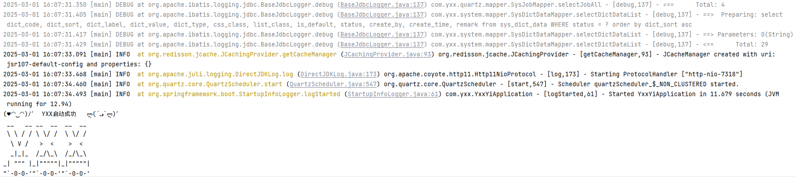
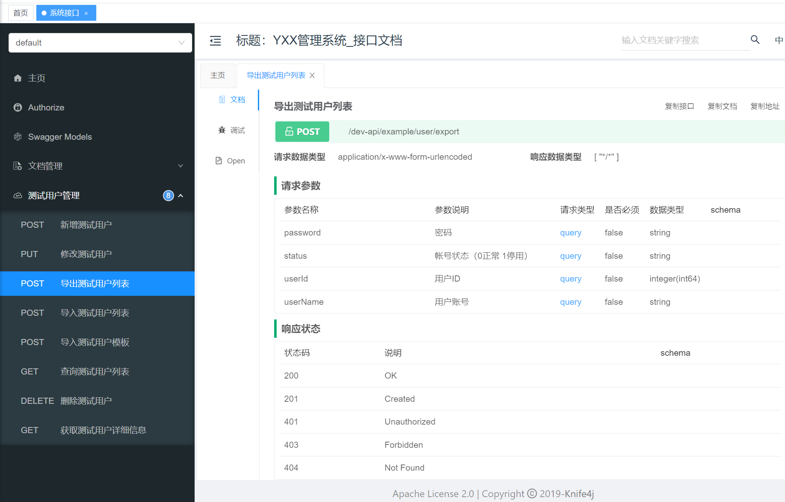
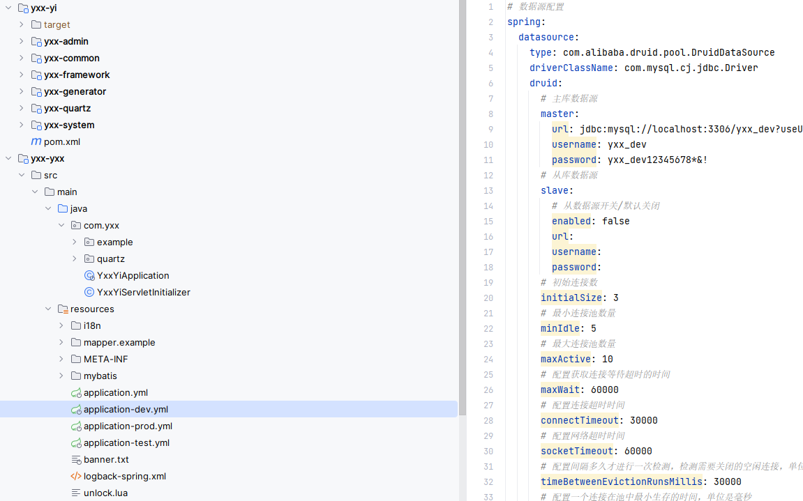

## 优化内容

演示地址：http://meraki-e.fun/yxx-yi/

### 功能优化

- 优化代码生成器
  - 增加`swagger`注解代码生成支持，能够在生成`CRUD`代码的基础上自动生成`swagger`注解
  - 增加`Excel`导入功能，支持模板下载，批量导入，自动映射字典等功能，优化`Excel`的导入功能
  - 增加前端的`Excel`对话框导入代码生成支持，后端接口的代码生成支持
  - 增加对`MyBatisPlus`的代码生成支持，在代码生成时自动集成`MyBatisPlus`
  - 增加对`lombok`的代码生成支持，在代码生成时优化`domain`的生成代码

- 优化定时器功能
  - 在`成功`、`失败`两个状态的基础上增加`警告`执行结果
  - 增强定时器的日志支持，能够在`成功`、`失败`、`警告`状态都记录结果日志
  - 增加对日志的检索功能，在日志模块能够快速基于执行日志进行检索

- 优化服务监控功能
  - 增加对应用的监控，展示内存监控、CPU占用监控、进程状态、端口监听监控等应用监控信息
  - 支持远程调用，能够支持作为简单的服务器监听应用

### 前端优化

- 优化登录、注册界面，优化对手机端的兼容适配
- 优化前端多环节打包、统一前后端环境名称、优化前端开发时debug超时问题
- 修复前端缺乏代理而无法使用preview模式的问题
- 优化菜单栏的样式和单菜单选择逻辑
- 增加前端对网站子目录部署的支持，包括静态资源请求、路由的统一前缀、登录请求的重定向

### 后端优化

- 优化模块依赖关系，基础框架依赖为`yxx-yi`，汇总模块为`yxx-yxx`模块，可以直接在此模块下编写业务代码
- 新增多环境打包，多yaml文件和多环境sql，可以直接通过`maven`控制打包
- 增加`MyBatisPlus`支持，封装分页逻辑，基于`MyBatisPlus`进行二次封装
- 增加`Redisson`，全局唯一ID生成、分布式事务、lua脚本分布式锁、分布式队列工具类
- 优化`druid`连接池，合理分配不同环境连接线程，新增连接超时配置
- 优化日志模块，控制台输出和日志输出，更加详尽并支持IDEA点击跳转到对应代码行，支持多环境日志级别
- 引入`hutool`依赖，增加的`JsonUtils`、`ObjectUtils`、`SerializationUtils`等工具类
- 优化异步线程池，支持函数式编程
- 增加编程式事务支持，可以使用函数式编程
- 优化`Session`会话存储，使用`Redis`作为存储中介
- 升级`swagger`为`knife4j`，优化接口文档，增加访问安全
- 优化通用控制器`BaseController`
- 优化`springmvc`处理`json`规则，增加`JacksonConfig`配置类

### 部署优化

- 增加项目部署`nginx.conf`配置文件，包括反向代理配置、静态文件匹配配置、nginx性能优化配置等
- 优化`windows`端和`linux`端项目启停控制脚本

## 待优化

- 前端登录注册界面逻辑统一
- 多租户sass功能支持

## 平台简介

若依是一套全部开源的快速开发平台，毫无保留给个人及企业免费使用。

* 前端采用Vue、Element UI。
* 后端采用Spring Boot、Spring Security、Redis & Jwt。
* 权限认证使用Jwt，支持多终端认证系统。
* 支持加载动态权限菜单，多方式轻松权限控制。
* 高效率开发，使用代码生成器可以一键生成前后端代码。
* 提供了技术栈（[Vue3](https://v3.cn.vuejs.org) [Element Plus](https://element-plus.org/zh-CN) [Vite](https://cn.vitejs.dev)）版本[RuoYi-Vue3](https://gitcode.com/yangzongzhuan/RuoYi-Vue3)，保持同步更新。
* 提供了单应用版本[RuoYi-Vue-fast](https://gitcode.com/yangzongzhuan/RuoYi-Vue-fast)，Oracle版本[RuoYi-Vue-Oracle](https://gitcode.com/yangzongzhuan/RuoYi-Vue-Oracle)，保持同步更新。
* 不分离版本，请移步[RuoYi](https://gitee.com/y_project/RuoYi)，微服务版本，请移步[RuoYi-Cloud](https://gitee.com/y_project/RuoYi-Cloud)

## 内置功能

1.  用户管理：用户是系统操作者，该功能主要完成系统用户配置。
2.  部门管理：配置系统组织机构（公司、部门、小组），树结构展现支持数据权限。
3.  岗位管理：配置系统用户所属担任职务。
4.  菜单管理：配置系统菜单，操作权限，按钮权限标识等。
5.  角色管理：角色菜单权限分配、设置角色按机构进行数据范围权限划分。
6.  字典管理：对系统中经常使用的一些较为固定的数据进行维护。
7.  参数管理：对系统动态配置常用参数。
8.  通知公告：系统通知公告信息发布维护。
9.  操作日志：系统正常操作日志记录和查询；系统异常信息日志记录和查询。
10. 登录日志：系统登录日志记录查询包含登录异常。
11. 在线用户：当前系统中活跃用户状态监控。
12. 定时任务：在线（添加、修改、删除)任务调度包含执行结果日志。
13. 代码生成：前后端代码的生成（java、html、xml、sql）支持CRUD下载 。
14. 系统接口：根据业务代码自动生成相关的api接口文档。
15. 服务监控：监视当前系统CPU、内存、磁盘、堆栈等相关信息。
16. 缓存监控：对系统的缓存信息查询，命令统计等。
17. 在线构建器：拖动表单元素生成相应的HTML代码。
18. 连接池监视：监视当前系统数据库连接池状态，可进行分析SQL找出系统性能瓶颈。

## 在线体验

- admin/admin123

演示地址：http://meraki-e.fun/yxx-yi/
