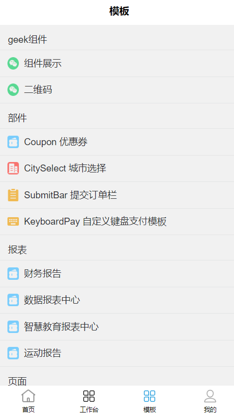
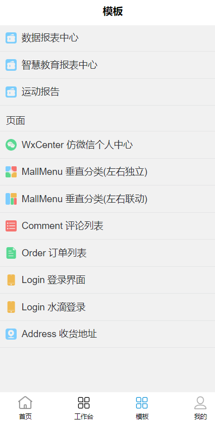
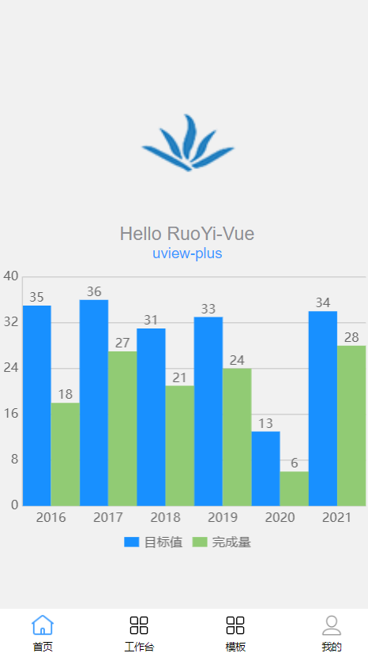
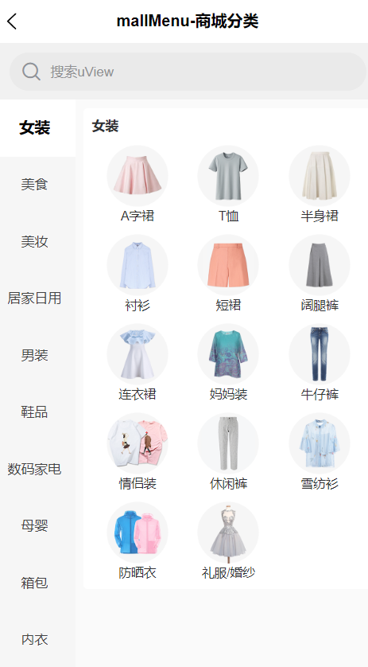

# README

**注意：** node 版本需要 16+

## 迁移到Hbuilder（不依赖Hbuilder的项目不需要迁移）

1. src路径作为项目根路径
2. 将index.html、package.json、vite.config.js、tsconfig.json、.gitignore粘贴到src目录下
3. 在src目录下运行npm install
4. 修改index.html中的./src/main.js为./main.js
5. 在HBuilderX中运行时注意观察是否使用的是Vue3的编译器（若不是请自行查找方法解决，本人对HbuilderX使用不多）

## 安装

一下三种方式均可，感觉速度 pnpm > yarn > cnpm > npm

**_Vue3/Vite 版要求 node 版本^14.18.0 || >=16.0.0_**

```shell
npm install
cnpm install
yarn
pnpm install
```

## 启动

1. 将项目下载到本地
2. 初始化项目---进入项目根路径运行指令初始化项目
   `npm install`
3. 运行项目---进入项目根路径运行指令（在 package.json 能找到所有指令）：
   以微信小程序为例：`npm run dev:mp-weixin`
   以 H5 为例 ` npm run dev:h5`
4. 查看项目 以微信小程序为例：
   打开微信开发者工具，导入项目路径 dist\dev\mp-weixin
   以 H5 为例：打开浏览器，输入控制台输出的地址
   注：公众号属于 H5，以微信公众号为例，打开微信开发者工具，输入控制台输出的地址
5. 打包项目---进入项目根路径运行指令（在 package.json 能找到所有指令）：
   以微信小程序为例：`npm run build:mp-weixin`
   以 H5 为例： `npm run build:h5`

### 代码压缩

默认是启动代码压缩的，

如果需要关闭代码压缩，可以将 vite.config.js 中的 build.minify 赋值为 false。

如果需要打开代码压缩，可以将 vite.config.js 中的 build.minify 赋值为 true。

## 内置组件(geek-xd)

1. 颜色选择器组件
2. 二维码组件
3. 圆形菜单组件
4. 常用的订单组件
5. 信息展示组件

## 插件的使用

### tab - 页面插件

可以通过设置参数中的 config.data 来实现页面传参

| 方法         | 作用                                             | 参数        |
| ------------ | ------------------------------------------------ | ----------- |
| getData      | 可以拿到上个页面通过 tab 传递的参数              | 无          |
| reLaunch     | 关闭所有页面，打开到应用内的某个页面             | url、config |
| switchTab    | 跳转到 tabBar 页面，并关闭其他所有非 tabBar 页面 | url、config |
| redirectTo   | 关闭当前页面，跳转到应用内的某个页面             | url、config |
| navigateTo   | 保留当前页面，跳转到应用内的某个页面             | url、config |
| navigateBack | 关闭当前页面，返回上一页面或多级页面             | config      |

### auth - 鉴权插件

下面所有方法返回值都是布尔值，permission 代表权限字符串，role 代表角色字符串，复数形式代表数组。

| 方法        | 作用                                       | 参数        |
| ----------- | ------------------------------------------ | ----------- |
| hasPermi    | 验证用户是否具备某权限                     | permission  |
| hasPermiOr  | 验证用户是否含有指定权限，只需包含其中一个 | permissions |
| hasPermiAnd | 验证用户是否含有指定权限，必须全部拥有     | permissions |
| hasRole     | 验证用户是否具备某角色                     | role        |
| hasRoleOr   | 验证用户是否含有指定角色，只需包含其中一个 | roles       |
| hasRoleAnd  | roles                                      | roles       |

### modal - 弹窗插件

content 是消息内容，option 是详细配置。

| 方法         | 作用                           | 参数    |
| ------------ | ------------------------------ | ------- |
| msg          | 消息提示                       | content |
| msgError     | 错误消息                       | content |
| msgSuccess   | 成功消息                       | content |
| hideMsg      | 隐藏消息                       | 无      |
| alert        | 弹出提示                       | content |
| confirm      | 确认窗体                       | content |
| showToast    | 提示信息                       | option  |
| loading      | 打开遮罩层，需要手动关闭遮罩层 | content |
| closeLoading | 关闭遮罩层                     | 无      |

### bus - 事件插件

eventName 是事件名称，eventFun 是事件处理函数，请尽量避免事件插件的使用，请在组件销毁是解绑素有该组件有关的事件，避免产生 bug。

| 方法  | 作用         | 参数                |
| ----- | ------------ | ------------------- |
| $on   | 绑定一个事件 | eventName、eventFun |
| $off  | 解绑一个事件 | eventName           |
| $emit | 触发一个事件 | eventName、...args  |

### socket

设置项 enableUUID，是否启用基于 uuid 的消息处理机制，要求当发送的消息携带 uuid 字段时，返回的消息也要携带 uuid 字段。

设置项 enableEvent，是否启用基于事件的消息处理机制，要求当希望被事件处理函数处理的消息需要携带 event 字段。

| 方法      | 作用                                                                                                                    | 参数                                                                                                                                    |
| --------- | ----------------------------------------------------------------------------------------------------------------------- | --------------------------------------------------------------------------------------------------------------------------------------- |
| connect   | 连接 websocke，当连接成功后触发回调函数                                                                                 | 最简单的用法就是传入{url:"ws://demo"}                                                                                                   |
| send      | 发送信息，当 uuid 不为空且不为 false 时，当收到携带相同 uuid 的消息时触发回调函数，只触发一次。否则由默认处理函数处理。 | msg 消息内容，会被处理成 json 字符串 uuid 唯一标识符，可以手动传入，也可以设置为 true 当为 true 时会自动生成一个 uuid 并添加到 msg 中。 |
| close     | 关闭连接，会触发回调函数的内容，不会触发默认关闭事件的处理函数，也不会修改默认关闭事件的处理函数。                      | 无                                                                                                                                      |
| on        | 监听事件，当收到携带 event 的消息时会调用回调函数。                                                                     | event 事件的名称                                                                                                                        |
| off       | 取消监听事件                                                                                                            |                                                                                                                                         |
| onMessage | 定义默认监听事件                                                                                                        | callback 默认监听事件的处理函数                                                                                                         |
| onError   | 定义异常事件                                                                                                            | callback 默认异常事件的处理函数                                                                                                         |
| onClose   | 定义关闭事件                                                                                                            | callback 默认关闭事件的处理函数                                                                                                         |

## 建议

### 对于选项式

```js
this.$tab; // 建议使用this.$tab进行页面跳转，理由：便于在跳转前处理其他事务
this.$auth; // 建议使用this.$auth进行鉴权操作
this.$modal; // 建议使用this.$modal打开弹窗，理由：便于以后想要使用自定义弹窗
```

### 对于组合式

```js
import tab from "@/plugins/tab"; // 建议使用tab进行页面跳转，理由：便于在跳转前处理其他事务
import auth from "@/plugins/auth"; // 建议使用auth进行鉴权操作
import modal from "@/plugins/modal"; // 建议使用modal打开弹窗，理由：便于以后想要使用自定义弹窗

// 也可以使用下面的方式
import { tab, auth, modal } from "@/plugins";
```

### 对于 ucharts

建议即便暂时不使用图表也不要删除它，以后可能会用到。

## 压缩内存

(主包最低 809kb 左右)

### 删除 geek 组件

1. 删除 pages_geek 和 components/geek-xd 文件夹
2. 删除 pages.json 中 subPackages 的 root 值为“pages_geek/pages”的配置
3. 删除 pages/template.config.js 中 geek 组件

### 去除模板

（占用主包 582kb 左右）

1. 删除 pages_template、pages_qiun 两个文件夹
2. 删除 pages.json 中 subPackages 的 root 值为“pages_qiun/pages”、“pages_template/pages”的两个配置
3. 删除 pages/template.config.js 和 pages/template.vue
4. 删除 pages.json 中 subPackages 的“tabBar”中的模板一项和“pages”中模板的一项
5. 删除 static 中的 uview，里面都是示例图片。
6. 删除 plugins 中的 config.js 和 common.js，并在 plugins/index.js 中删除相关配置

### 删除 uchart

（占用主包 175kb 左右，不建议删除，以防以后会用）

1. 删除 components/qiun-data-charts 文件夹
2. 删除 pages.json 中的 easycom 下的 custom 中的"qiun-(.\*)"的那一行
3. 删除 pages/index 中使用 “qiun-data-charts” 的部分

### 删除 uview

（按需引入，没必要删除）

1. main.js 或者 main.ts 中删除

```js
import uviewPlus from "uview-plus";
// ......
app.use(uviewPlus);
```

2. uni.scss 中删除 @import 'uview-plus/theme.scss';
3. App.vue 中删除 @import '@/static/scss/index.scss';
4. package.json 中删除 "clipboard": "^2.0.11","dayjs": "^1.11.9","uview-plus": "^3.1.36",

## 功能演示

<table>
    <tr>
        <td></td>
        <td></td>
    </tr>
    <tr>
        <td></td>
        <td></td>
    </tr>
</table>
